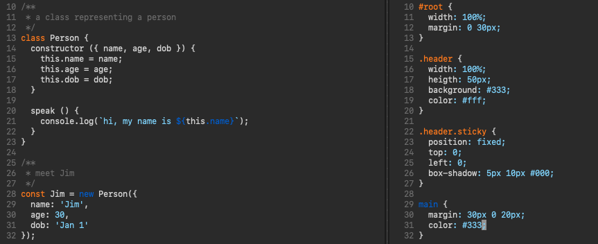

# Breeze for [Vim](http://www.vim.org/)

> A dark, orange and blue theme for [Vim](http://www.vim.org/).

## Notes from fork maintainer

This is forked from [dracula/vim](https://github.com/dracula/vim). All credit goes to the dracula team for making this possible.

## Install

All instructions can be found at
[draculatheme.com/vim](https://draculatheme.com/vim).

Note that dracula must be in your `'runtimepath'` to load properly: Version 2.0
introduced autoload functionality for part of the plugin, which doesn't work
without `'runtimepath'` properly set.

For users of Vim 8's `|packages|` feature, it suffices to put

    packadd! {name}
    colorscheme dracula

in your vimrc. `{name}` Should be replaced by the directory you put the code in.
For example, if you use `~/.vim/pack/themes/start/my-dracula-theme`, you would do
`packadd! my-dracula-theme`.

For users of other plugin managers, consult your documentation
to make sure you put dracula on the `'runtimepath'` before loading it.                                                       |

## License

[MIT License](./LICENSE)
